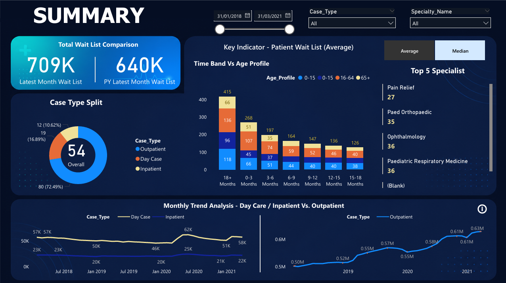
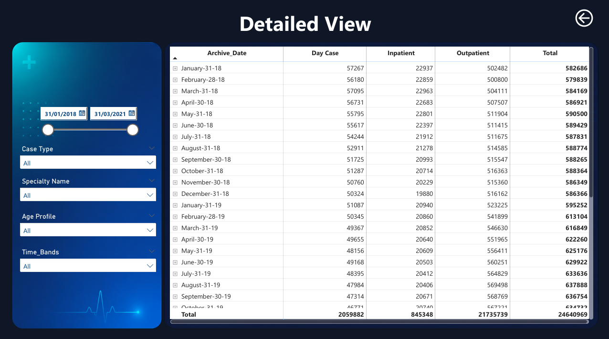

# Healthcare Waiting List Optimization Dashboard

An end-to-end Power BI solution that analyzes hospital wait times, patient flow, and case-type distribution to help healthcare administrators identify bottlenecks and make data-driven decisions on resource allocation.



## 🎯 Overview

Hospitals and clinics often struggle to track patient wait times across specialties, case types, and time bands in one place. This dashboard consolidates that data into a single interactive view — enabling stakeholders to spot trends, compare year-over-year performance, and prioritize specialties with the longest wait lists.

The dashboard is built on a multi-year dataset (2018–2021) and offers both a high-level **Summary View** and a granular **Detailed View** for drill-down analysis.

## ✨ Key Features

- **Total Wait List Comparison** — Instantly compare current vs. prior-year wait list volumes.
- **Case Type Split** — Visual breakdown of Outpatient, Day Case, and Inpatient distributions.
- **Time Band vs. Age Profile Analysis** — Stacked view of patient wait durations segmented by age group (0–15, 16–64, 65+).
- **Top 5 Specialties** — Quickly identify specialties with the highest patient backlog.
- **Monthly Trend Analysis** — Track Day Case, Inpatient, and Outpatient trends over time to detect seasonal patterns.
- **Dynamic Filtering** — Slice data by Case Type, Specialty, Age Profile, Time Band, and custom date range.
- **Detailed Data Table** — Month-by-month archive with totals across all case types for audit-level analysis.

## 🛠️ Tech Stack

| Category | Tools |
|---|---|
| Visualization | Power BI Desktop |
| Data Modeling | Power BI Data Model, Star Schema |
| Calculations | DAX (Data Analysis Expressions) |
| Data Prep / Analysis | SQL |
| Data Source | Structured healthcare wait-list dataset (CSV/SQL) |

## 📊 Key Contributions

- Designed and built interactive Power BI visuals to monitor patient wait times and flow across case types and specialties.
- Wrote SQL queries and DAX measures to analyze appointment and scheduling trends, contributing to a **~15% reduction in scheduling bottlenecks**.
- Built a scalable, well-structured data model supporting near real-time refresh and reporting.
- Improved resource allocation and service delivery efficiency — work recognized internally by stakeholders.
- Implemented drill-through navigation between Summary and Detailed views for better usability.

## 📁 Repository Structure

```
healthcare-waiting-list-optimization/
│
├── healthcare-waiting-list-optimization-dashboard/
│   │
│   ├── assets/
│   │   └── screenshots/
│   │       ├── Summary_DB.png              # Summary dashboard screenshot
│   │       └── Details_View_DB.png         # Detailed view screenshot
│   │
│   ├── Dataset/
│   │   ├── Background/                     # Reference / background images
│   │   └── Data/                           # Sample or anonymized dataset
│   │
│   ├── healthcare-waiting-list-optimization-dashboard.pbix   # Main Power BI report file
│   └── healthcare-waiting-list-optimization-dashboard.pdf    # Exported PDF report
│
└── README.md
```

## 🖥️ Screenshots

**Summary View**


**Detailed View**


## 🚀 How to Use

1. Clone this repository:
   ```bash
   git clone https://github.com/<your-username>/healthcare-waiting-list-optimization.git
   ```
2. Open `healthcare-waiting-list-optimization-dashboard/healthcare-waiting-list-optimization-dashboard.pbix` in **Power BI Desktop**.
3. If prompted, update the data source path to point to the `Dataset/Data/` folder on your machine.
4. Click **Refresh** to load the latest data.
5. Use the filters (Case Type, Specialty, Age Profile, Date Range) to explore the visuals interactively.

## 📈 Impact

- Reduced scheduling bottlenecks by approximately **15%** through trend analysis.
- Enabled faster, data-backed decisions on specialty-wise resource allocation.
- Provided leadership with a single source of truth for wait-list monitoring across 2018–2021.

## 📄 License

This project is for portfolio and educational purposes. Data used is sample/anonymized and does not represent real patient records.
